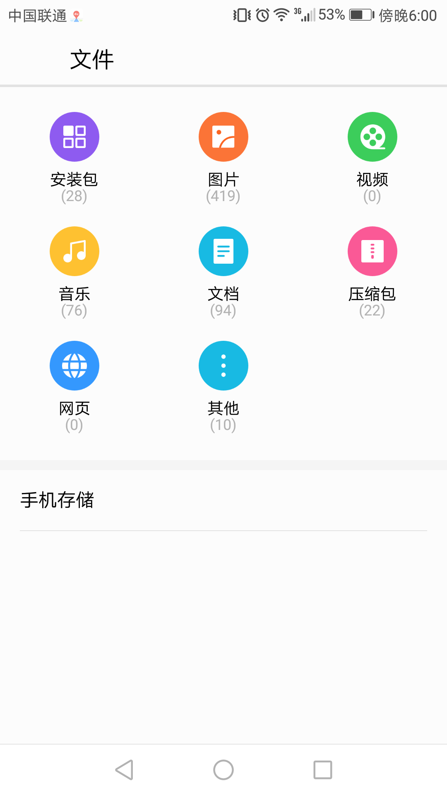

Cordova FileChooser Plugin

Requires Cordova >= 2.8.0

Install with Cordova CLI
	
	$ cordova plugin add https://github.com/GGwujun/cordova-plugin-filechooser.git

API

	fileChooser.open(successCallback, failureCallback);

The success callback get the uri of the selected file

	fileChooser.open(function(uri) {
		alert(uri);
	});
	
Screenshot

Supported Platforms:
- Android
- Windows (UWP)

TODO rename `open` to pick, select, or choose.
